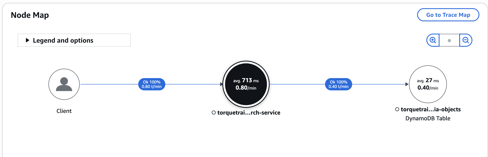
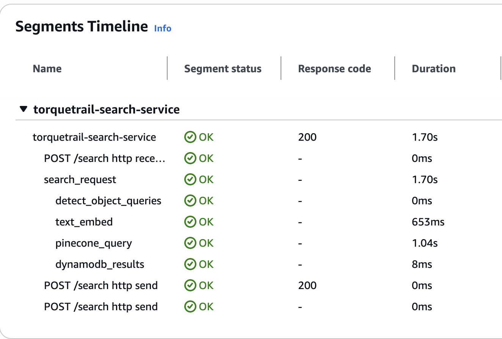
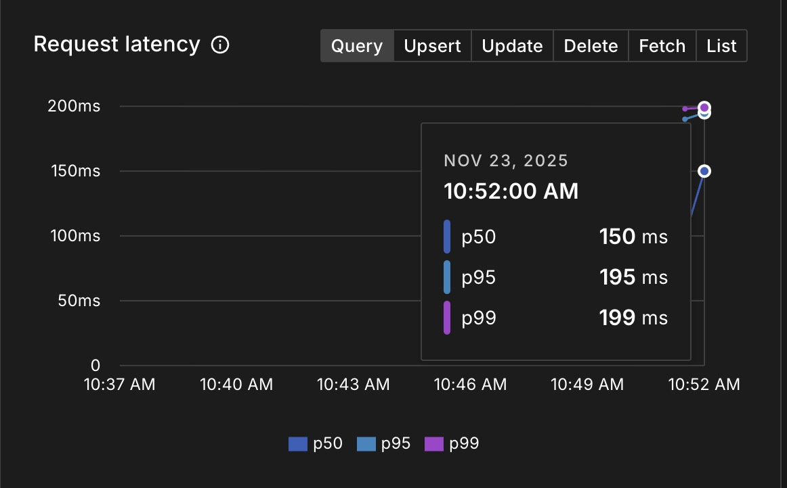
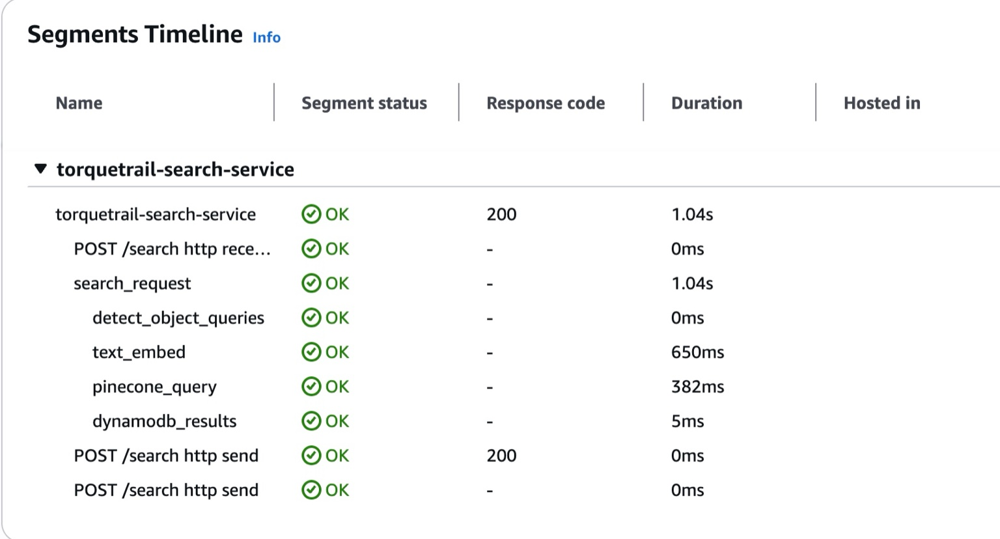
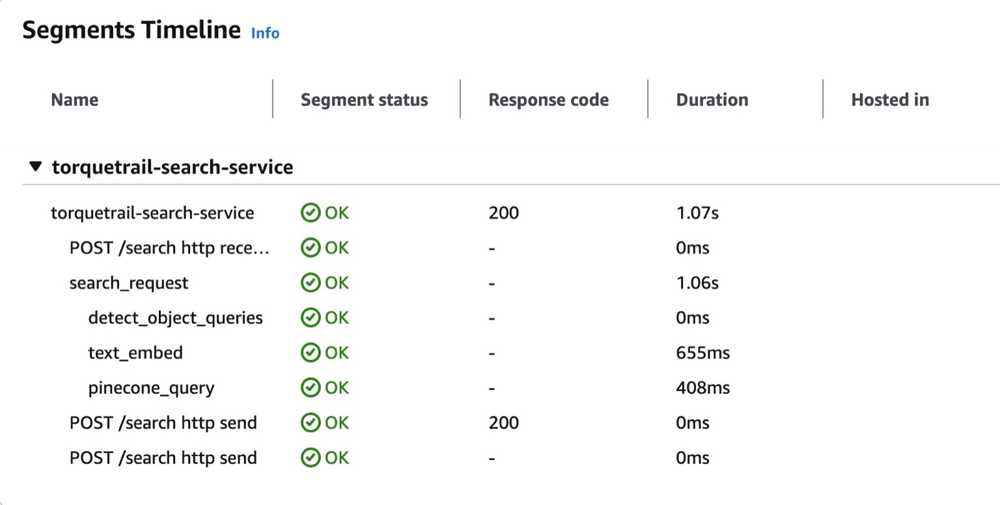

# TorqueTrail Search Latency & Cold Start Explanation

This Gist explains the **cold start behaviour** observed in TorqueTrail’s search service, backed by captured AWS X-Ray traces and Pinecone dashboards.

---

# Service map


## 📉 Pinecone Latency Metrics (Before GPU / Same-Region Optimisation)

### Cold start (pinecone 1s cold start)


### Warm reqiest 1: ~250–299ms Query Latency


### Warm request 2: ~150–199ms Query Latency (Later Warm Period)


---

## 🔍 AWS X-Ray Traces (EC2 Search Service)

### Image 3


### Image 4


---

# 🧊 Cold Start Behaviour — Explanation

### 1. **SigLIP Model Load (Major factor)**
Your EC2 instance loads the full SigLIP model on first request:
- Model size: Hundreds of MB
- On CPU: load time can spike to **300–600ms**
- Embedding warm-up also triggers PyTorch kernel compilation/JIT

Once loaded, subsequent requests skip this overhead — hence much faster (~150–250ms Pinecone latency + ~650ms embedding).

### 2. **Container / Process Warm-Up**
Even though you're using EC2 (not Lambda), long idle periods cause:
- Page cache eviction
- Memory cold state
- CPU frequency scaling (C-states)
- Python runtime JIT cold state

First request after idle hits:
- **Extra 50–150ms** Python overhead
- **Extra 30–80ms** network DNS + TLS

### 3. **Pinecone Internal Warm-Up**
Pinecone pods also warm up:
- Vector index mmap load into memory
- Search graph optimisations
- Cache refresh

First query spikes to **250–300ms**, then settles to ~150ms.

### 4. **Cross-Region RTT (Current Setup)**
Your current path:
```
EC2 (ap-south-1) → Pinecone (us-east-1)
```
Adds **250–300ms one-way**, ~600ms round-trip potential.
This shows up in X-Ray as ~382–408ms `pinecone_query`.

When Pinecone moves to same region:
- Query drops from **400ms → 100–150ms**

### 5. **Total Cold Start Impact**
Combined cold start adds:
```
+300–600ms   model load / JIT
+150–250ms   EC2 runtime warm-up
+100–200ms   Pinecone initial warm-up
-------------------------------------
≈ 600–1,050ms EXTRA on first request
```

Matches your observed **1.04s–1.07s** backend cold-start time.

---

# ✅ Warm State (After Few Requests)
After warm-up:
- SigLIP inference: **650ms** (CPU)
- Pinecone query: **150–200ms**
- DynamoDB: **20–50ms**

Backend = **850–950ms**  
Perceived UI = **1.8–2.3s** (Replit + CF fetch + region hops)

---

# 🚀 Next Steps to Achieve <300ms Backend Latency
1. Move Pinecone to **same region** (ap-south-1 or us-east-1)  
2. Run SigLIP inference on **GPU** (20–40ms)  
3. Keep model loaded (no container idling)  
4. Use ALB health checks to prevent EC2 idle sleep  
5. Enable PyTorch model warm-up on boot

---

This file contains all images inline for use in a GitHub Gist.
